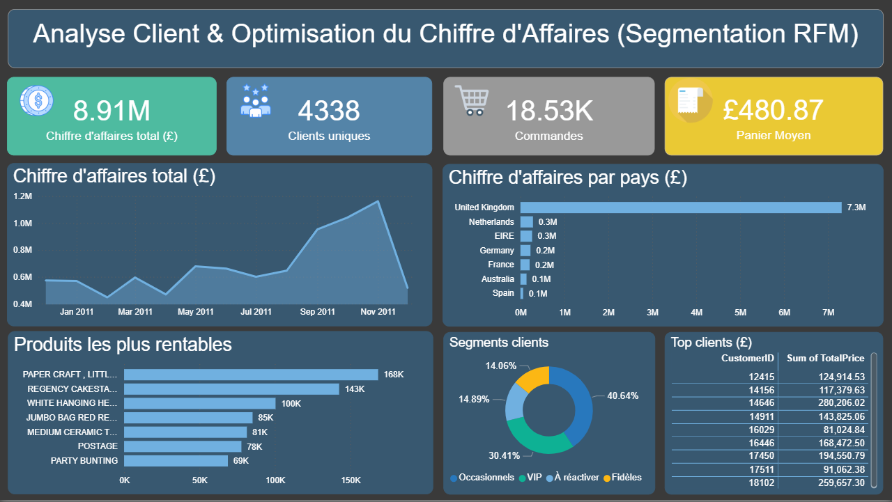

# 📊 Analyse Client & Optimisation du Chiffre d’Affaires (Segmentation RFM)

## 📌 Présentation du projet

Ce projet vise à analyser le comportement d’achat des clients d’un site e-commerce afin d’identifier des leviers de croissance et d’optimiser le chiffre d’affaires.

L’analyse combine :

* **Python** pour le traitement et l’analyse des données
* **Power BI** pour la visualisation et le pilotage

Objectif : transformer des données transactionnelles en **insights business exploitables**.

---

## 🎯 Objectifs

* Comprendre les comportements d’achat des clients
* Identifier les clients à forte valeur et les clients à risque
* Construire des indicateurs clés (KPI)
* Segmenter les clients avec la méthode RFM
* Proposer des recommandations business concrètes

---

## 📂 Dataset

* Source : Online Retail Dataset (e-commerce UK)
* ~540 000 transactions initiales
* ~398 000 lignes après nettoyage
* Données : clients, produits, dates, montants

---

## 🛠️ Outils & Technologies

* **Python (pandas)**
* **Power BI**
* **Excel**

---

## 📊 KPI principaux

* 💰 Chiffre d’affaires : **8.9M£**
* 👥 Nombre de clients : **4 338**
* 📦 Nombre de commandes : **18 532**
* 🧾 Panier moyen : **480£**
* 🔁 Fréquence d’achat : **4.27 commandes/client**

---

## 📈 Analyses réalisées

### 🔹 Nettoyage des données

* Suppression des valeurs manquantes (CustomerID)
* Suppression des transactions annulées
* Filtrage des quantités/prix négatifs
* Création de la variable **TotalPrice**

---

### 🔹 Analyse du chiffre d’affaires

* CA par pays
* CA mensuel (saisonnalité)
* Identification des marchés dominants

---

### 🔹 Analyse produits

* Top produits par chiffre d’affaires
* Identification des produits à forte valeur

---

### 🔹 Analyse clients

* Top clients générant le plus de revenu
* Fréquence d’achat
* Contribution au chiffre d’affaires

---

### 🔹 Segmentation RFM

Segmentation des clients selon :

* **Recency** : date du dernier achat
* **Frequency** : nombre de commandes
* **Monetary** : montant dépensé

Segments identifiés :

* 👑 VIP
* 🔁 Fidèles
* ⚠️ À réactiver
* 🧍 Occasionnels

---

## 💡 Insights clés

* Le chiffre d’affaires (8.9M£) est fortement concentré au Royaume-Uni (~82%)
* Une minorité de clients (segment VIP) génère une part significative du revenu
* 646 clients sont identifiés comme **à réactiver**, représentant un levier direct de croissance
* Une forte saisonnalité est observée avec un pic d’activité en fin d’année
* Certains produits dominent largement le chiffre d’affaires

---

## 🚀 Recommandations business

* Mettre en place des campagnes CRM pour réactiver les clients inactifs
* Fidéliser les clients VIP avec des offres personnalisées
* Diversifier les marchés pour réduire la dépendance au Royaume-Uni
* Exploiter la saisonnalité avec des campagnes marketing ciblées
* Optimiser les produits les plus rentables (stock, pricing, visibilité)

---

## 📊 Dashboard (Power BI)

Le dashboard permet de :

* Suivre les KPI clés (CA, clients, panier moyen)
* Visualiser l’évolution du chiffre d’affaires dans le temps
* Identifier les pays, produits et segments les plus performants

📷 Aperçu :


---

## 📁 Structure du projet

```text
.
├── data/
│   └── online_retail.csv
├── images/
│   └── churn_dashboard.png
├── online_retail_cleaned.csv
├── customer_rfm_segments.csv
├── segment_summary.csv
├── customer_analytics_retail.py
└── README.md
```

---

## 🎯 Résultat

Ce projet démontre ma capacité à :

* Manipuler et analyser des données volumineuses
* Construire des KPI business pertinents
* Segmenter des clients pour des usages marketing
* Produire des insights directement exploitables
* Créer des dashboards pour la prise de décision

---

## 🔗 Auteur

**Yassine Jouini** - À la recherche d’une alternance en Data Analyst / Business Intelligence pour contribuer à des projets à impact et orientés décision.
